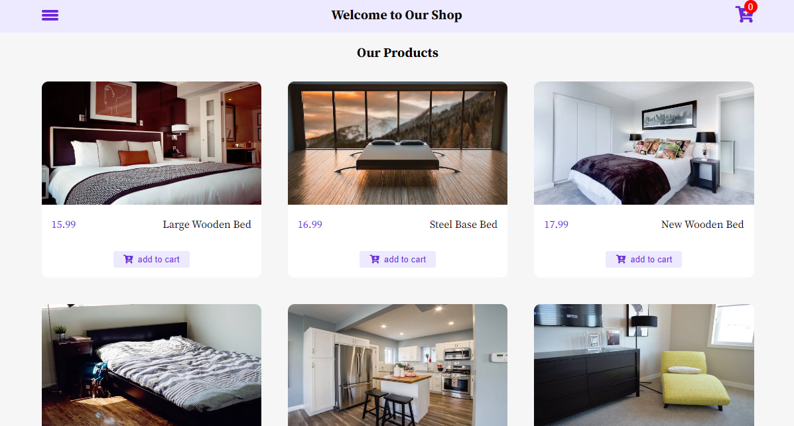

# Shopping Cart Project 🛒

## [App Online Link](https://shopping-cart-oop-app.netlify.app/)

## App Demo

---

## Description

A Simple Shopping Cart Project Where You Can Add Products to the Cart, Increase or Decrease the Number of Products, Remove one Product or all Products from the Cart;
On the Other Hand, See the Total Number of Products Purchased and the Total Cost of your Purchase.

This Modular Web App is Developed in Object-Oriented Programming Style (OOP)

This Project is Developed in a Component-Based;
You can Check Every Part of the HTML Structure of the Project in the Components Folder.

## Features

- Add Product to Cart
- Increase or Decrease the Number of Products
- Delete Product (or all Products from the Cart)
- Save Products in Local Storage (When the App is Loaded, the Products that are in the Shopping Cart, their Buttons Remain Inactive.)
- Calculation the Total Number of Products
- Calculation of the Total Purchase Amount

## Tips 📌

- fully responsive for mobile, tablet, laptop and desktop

## Web Development Technologies

- HTML5 (Semantic HTML)
- Pure CSS3 (FlexBox & Grid Layout)
- Vanilla JavaScript

## Contact Me

 

